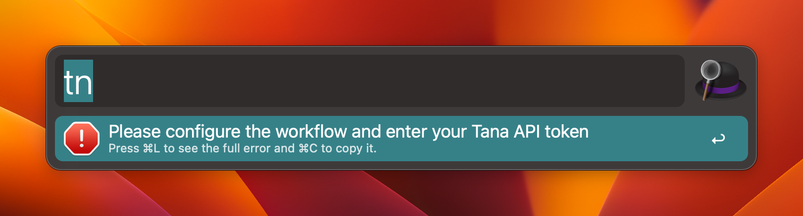
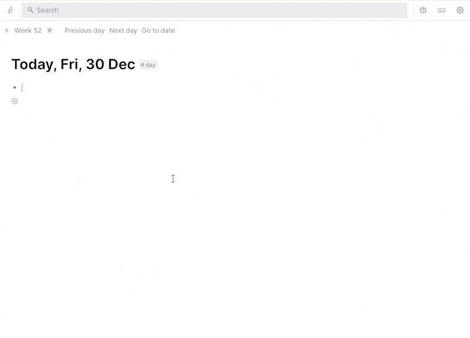
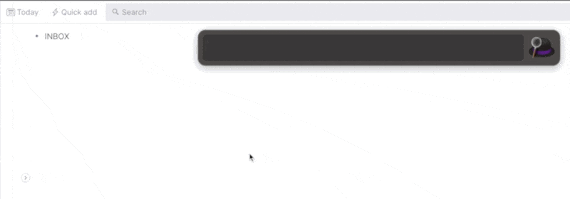

<h1 align="center">
Alfred Workflow for Tana

</h1>

An Alfred workflow for [Tana](https://tana.inc/)

## Install

Download the latest alfredworflow file from [the release page](https://github.com/aragorn-yang/alfred-workflow-for-tana/releases), and double click to install it.

## Usage

The workflow is triggered by `tn` prefix by default. 

### Tana API Token

When it's run with no Tana API token configured, you'll get a missing token hint.

Please go to your Tana graph, create a note and get its API token.

Paste the token into `tanaApiToken` in the **Configure Workflow** for this workflow.

### Add To Node

Now you can add quick notes to Tana without open Tana.

